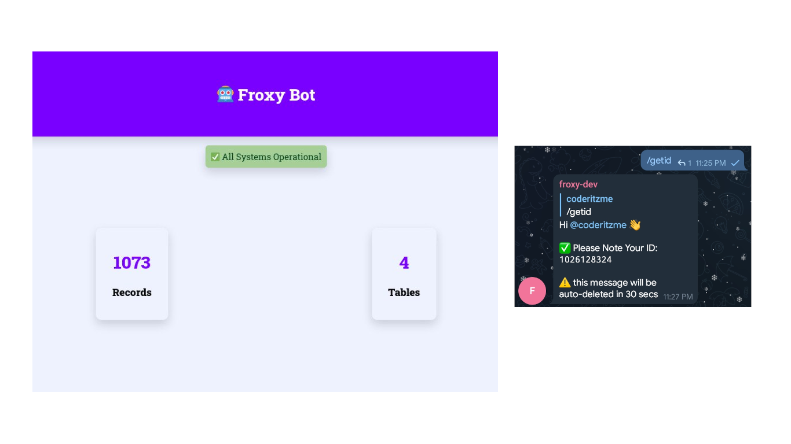

# 🤖 Froxy Bot

- Simple Telegram bot to supply user id when a user join on group chat
- creates separate table for each groups. 
- stores user information in DB when user joins
- auto deletes message after a predefined time
- Redesigned front end to show the Table & Record count.

  

### Set Up

- create a .env file or copy the [example.env](/example.env) and change values
- in .env file, DB_TYPE must be **one** of the following, `mysql' or 'mariadb' or 'postgres' or 'mssql'`
- countdown value must be in milliseconds, default: `30000` = 30 secs.

### Dev Notes
- from V2 release, certain functions (automatic table generating) will only work in MySQL like Databases. (runs in mariadb)
- table naming scheme: `<table_name>_<group_id>s`
	- the last character `s` is possibly added by Sequelize.
